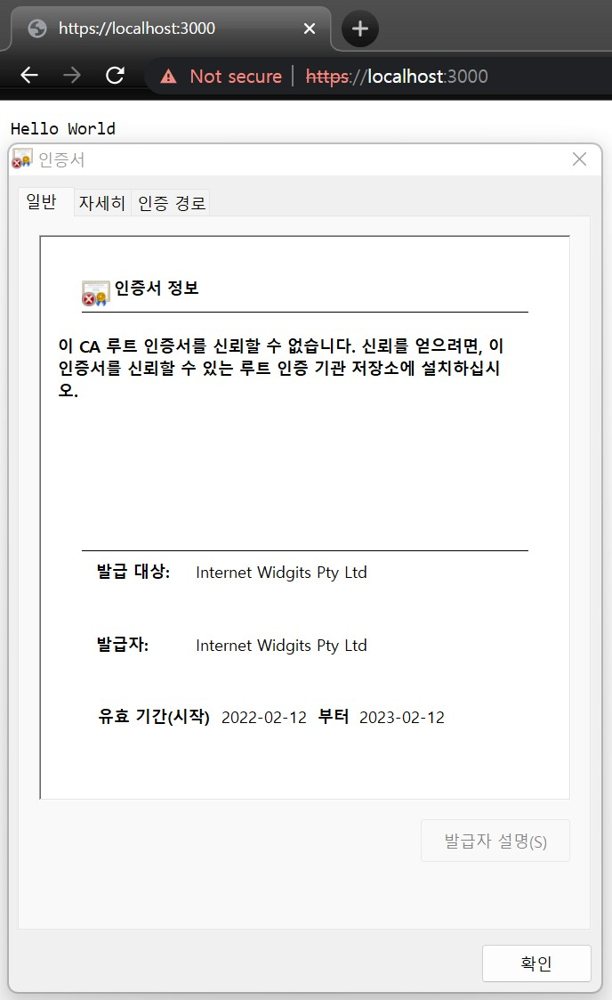

# HTTPS 웹 서버 만들기

1. Run `openssl req -new -newkey rsa:2048 -nodes -keyout localhost.key -out localhost.csr`
2. Run `openssl x509 -req -days 365 -in localhost.csr -signkey localhost.key -out localhost.crt`
3. Run `go run ex29.07.go`
4. 웹 브라우저에서 `https://localhost:3000` 실행
5. 보안 경고가 뜬다면 Advanced에서 **_Proceed to localhost (unsafe)_** 클릭

    
